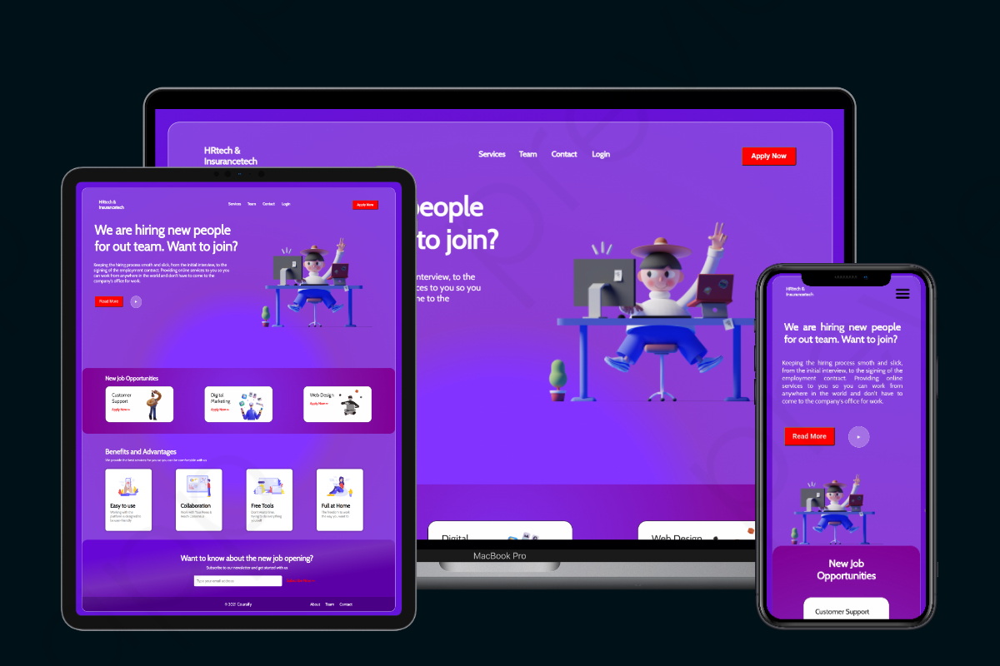

<h1 align="center">Hiring Platform</h1>
<h5 align="center">A frontend version of a Hiring Platform that one can use to get jobs</h5>

<br/>

## 🎯 About

I started this project with the purpose of learning and integrating React JS and other libraries. <br/>
I have put a lot of effort into it and I hope that you will like it.
The Web App lands you to an appealing Landing Page, in which the user can choose to sign up by applying or to log in.
<br/><br/>
➡️ Go try it and please let me know if you enjoyed it with a ⭐️, I would appreciate it a lot.
<br/>
<br/>

<!-- ## ▶️ Demo

Here you can find the demo link:

[https://linkedin-clone-6a462.web.app](https://linkedin-clone-6a462.web.app/) -->

## ✨ Features

✔️: &nbsp;&nbsp;Hiring platform for job seekers<br />
✔️: &nbsp;&nbsp;React-Reveal animation (credits: [rnosov
/
react-reveal](https://github.com/rnosov/react-reveal)) for the page animations<br />
✔️: &nbsp;&nbsp;Responsive layout<br />

## 🚀 Technologies

- [React](https://reactjs.org/)
- [SALY-3D Illustrations](<https://www.figma.com/file/CZ3QgX4nk0LGcGFIsru90Y/SALY---3D-Illustration-Pack-(Community)?node-id=439%3A0>)
- [React-Reveal](https://www.react-reveal.com/)
- [CSS Gradient](https://cssgradient.io/)
  <br/>

# 📸 Preview


<br/>

<br/>

## ✅ Requirements

Before starting you need to have [Git](https://git-scm.com) and [Node](https://nodejs.org/en/) installed.

<br/>

## 🔗 Run Locally

- Clone the project

```bash
  git clone https://github.com/shivendradb/Hiring-Website-ReactJS.git
```

- Go to the project directory

```bash
  cd Hiring-Website-ReactJS
```

- Install dependencies

```bash
  npm install
```

- Start the server

```bash
  npm start
```

Note: <br/>
The page will reload if you make edits. <br/>
You will also see any lint errors in the console.

<br/>

#### **Please let me know if you enjoyed it with a ⭐️, I would appreciate it a lot.**
